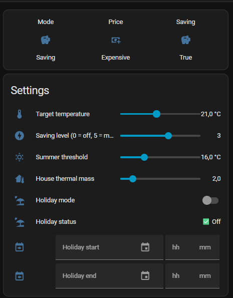
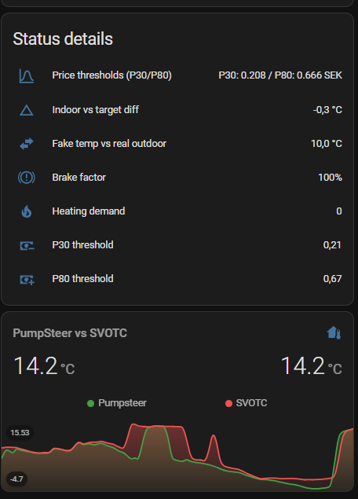
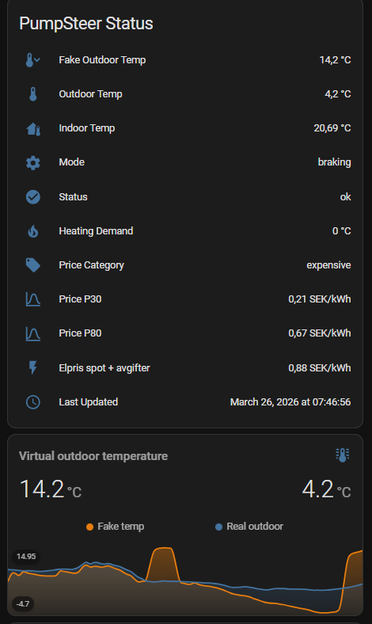
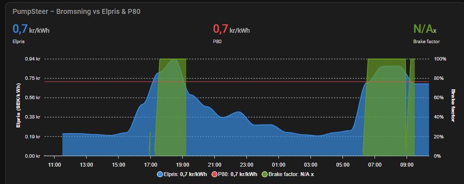

# 🔥 PumpSteer 2.0 – Smart Heat Pump Optimization

➡️ Swedish version: [README (Svenska)](README_sv.md)

> ⚠️ This is a major rewrite. Read upgrade notes before installing.

PumpSteer is a Home Assistant custom integration that optimizes your heat pump by dynamically adjusting the **virtual outdoor temperature**.

It reduces energy cost when electricity is expensive — while protecting indoor comfort.

---

## 📸 Dashboard Preview

---

## 📘 Documentation

- [Upgrade Warning](#important--not-a-drop-in-upgrade-)
- [What's New](#whats-new-in-200)
- [Breaking Changes](#breaking-changes)
- [Price Sensors](#price-sensor-support)
- [Weather Support](#weather-support)
- [New Installation](#new-installation)
- [Dashboard (Lovelace)](#lovelace-dashboard-mini-graph-card--apexcharts-card)
- [Upgrade Guide](#upgrade-from-166)
- [Troubleshooting](#troubleshooting)
- [Tuning](#tuning-quick-guide)
- [Safety](#safety--disclaimer)

---

## Important – Not a Drop-in Upgrade ⚠️

PumpSteer 2.0.0 is **not a minor update**.  
It is a **complete rewrite of the control system**.

👉 Treat this as a **new integration**, not an upgrade.

### What this means

- ❌ Old dashboards will not behave the same  
- ❌ Automations may break  
- ❌ Old helpers are no longer primary  
- ❌ Price logic is completely changed  

---

## ⚠️ Disclaimer

You use this integration at your own risk. Heating is a critical system in your home, and incorrect settings may lead to discomfort or damage.

Do not use PumpSteer if your heating system is not functioning properly.

Only use PumpSteer if you understand how it works and have verified that it functions correctly in your specific setup. Always monitor indoor temperatures and system behavior after installation.

---

### Required after upgrade

- Rebuild Lovelace cards  
- Update automations  
- Verify price sensors (today + tomorrow)  
- Reconnect to new entities  
- Retune settings  

---

### Behavior is different

- PI control instead of heuristics  
- Ramped braking  
- Forecast-aware decisions  

➡️ Do not expect behavior identical to 1.6.6  

---

### Recommendation

1. Install 2.0.0  
2. Observe for 24–48h  
3. Then migrate fully  

---
## 🔧 How PumpSteer Controls Your Heat Pump

PumpSteer does **not** control your heat pump via Modbus, cloud APIs, or thermostat setpoints.

Instead, it works by influencing the **outdoor temperature sensor input**.

This approach is commonly used to influence heat pump behavior without modifying internal firmware or control systems.

In setups like mine, this is done using an external device such as  
👉 Ohmigo Ohm On WiFi Plus  
🔗 [Ohmigo Ohm On WiFi Plus](https://www.ohmigo.io/en/product-page/ohmigo-ohm-on-wifi)

This device is connected to the heat pump’s outdoor temperature sensor circuit and allows Home Assistant to adjust the **resistance** seen by the heat pump.

By changing the resistance, the device simulates a different outdoor temperature for the heat pump.

---

### 🧠 How it works

PumpSteer calculates a **virtual outdoor temperature** based on:

- Indoor temperature  
- Target temperature  
- Electricity price  
- Weather forecast  
- Selected aggressiveness level  

This calculated value is then sent to the external device (e.g. Ohm On WiFi Plus), which manipulates the sensor signal.

👉 The heat pump believes the outdoor temperature has changed  
👉 And adjusts heating accordingly  

---

### ⚡ What this enables

- Reduce heating during expensive electricity hours  
- Preheat when electricity is cheap  
- Maintain indoor comfort as top priority  
- Optimize without modifying the heat pump’s internal control  

---

### 🏠 Example system architecture

1. Home Assistant runs PumpSteer  
2. PumpSteer calculates virtual outdoor temperature  
3. Ohm On WiFi Plus adjusts resistance  
4. Heat pump reacts automatically  

---

### ⚠️ Important

- This method requires hardware capable of influencing the outdoor sensor signal  
- Installation depends on your heat pump model  
- Always verify wiring and safety before use  
---

## What's New in 2.0.0

PumpSteer 2.0.0 introduces a completely redesigned control system focused on stability, predictability, and cost optimization.

- 🧠 PI-based control (replaces heuristics)  
- ⚡ Smart price classification (`cheap / normal / expensive`)  
- 🔁 State machine (predictable behavior)  
- 🧊 Dynamic braking (ramp + hold + filtering)  
- 🌦 Forecast-aware planning (optional)  
- 🏠 Integration-managed entities  
- 🔒 Fully local (no cloud)  

---

## Breaking Changes

### Price categories changed

Old:
- `very_cheap`
- `very_expensive`
- `extreme`

New:
- `cheap`
- `normal`
- `expensive`

---

### Price sensor requirements

Must support:
- `today/raw_today`  
- `tomorrow/raw_tomorrow`  

---

### Control system rewritten

- Old: heuristic logic  
- New: PI + state machine  

---

### Braking redesigned

- Ramping  
- Hold logic  
- Peak filtering  
- Comfort protection  

---

### Integration owns entities

- numbers  
- switch  
- datetime  

---

### ML removed

---

## Price Sensor Support

Supported formats:

- `0.95`  
- `"0.95"`  
- `{ "value": 0.95 }`  
- `{ "price": 0.95 }`  

📌 Recommended example:  
[`other/nordpool.yaml`](other/nordpool.yaml)

✔ Works with:
- Official Nord Pool integration + my example (see above) ⚠️

---

### ℹ️ About `pump_packages.yaml`

The file:  
[`other/pump_packages.yaml`](other/pump_packages.yaml)

is **not a full Home Assistant package** like in earlier versions (e.g. 1.6.6).

It now mainly contains:

- Template sensors  
- Example configurations  
- Helper logic used by PumpSteer  

⚠️ Important:

- It is **not intended to be used as a complete drop-in package**  
- It does **not configure the full system automatically**  
- You should **not expect it to replace the integration setup**  

👉 Use it as a **reference or optional add-on**, not as a full configuration  

---

### Migration note (from 1.6.6)

If you previously used full package files:

- PumpSteer 2.0.0 no longer relies on package-based configuration  
- The integration now handles:
  - control logic  
  - entities  
  - settings  

You may still use `pump_packages.yaml` for:
- additional sensors  
- custom templates  
- extended functionality  

But the **core control is now inside the integration**  

---

## Weather Support

Examples:
- `weather.smhi_home`  
- `weather.yr_home`  
- `weather.openweather`  

⚠️ Must be selected in:  
Settings → Devices → PumpSteer → Configure  

---

## New Installation

### Step-by-step

1. Install via HACS or manually  
2. Restart Home Assistant  
3. Add integration  
4. Select required sensors  

---

### First validation

- `sensor.pumpsteer` active  
- `status = ok`  
- `price_category` changes  
- `mode` behaves logically  

---

## Lovelace Dashboard (mini-graph-card & apexcharts-card)

📁 See [`/dashboards/`](dashboards/) folder for ready-to-use examples  

PumpSteer includes example Lovelace configurations using `mini-graph-card` and `apexcharts-card`.

These dashboards show:
- Indoor temperature  
- Target temperature  
- Virtual outdoor temperature  
- Price behavior and system response  

---

### ⚠️ Requirement

You must install:

- **mini-graph-card**  
- **apexcharts-card**  

Available via HACS:
- Frontend → `mini-graph-card`  
- Frontend → `apexcharts-card`  

---

### 📥 How to use the provided templates

1. Go to your Home Assistant dashboard  
2. Click **Edit dashboard**  
3. Click the **pencil icon (✏️)**  
4. Click the **three dots (⋮)**  
5. Select **Edit dashboard (Raw configuration editor)**  
6. Paste the YAML  
7. Save  

⚠️ Note:  
Pasting a full view may overwrite your existing dashboard.  

---

### 🧠 Important

- These templates are **YAML-based**  
- They are **not built via UI**  
- Some may replace the entire view  

---

### 🔧 Common adjustments

After pasting, check:

- `sensor.pumpsteer`  
- temperature sensors  
- custom entities  

---

### 💡 Tips

- No graph → check entity IDs  
- Card not loading → check installation  
- Debug via Developer Tools → States  

---

## Upgrade from 1.6.6

### Required

- Update price categories  
- Configure tomorrow price  
- Update automations  
- Remove ML  

---

### Recommended

- Verify price attributes  
- Configure weather entity  
- Update holiday automations  

---

### Testing

- Check `mode`  
- Check `brake_factor`  
- Observe expensive periods  

---

## Troubleshooting

### Safe mode

Cause:
- Missing price data  

Fix:
- Check `today/raw_today`  
- Check `tomorrow/raw_tomorrow`  

---

### No braking

Cause:
- Price is not in the expensive range  
- Comfort protection is active  

---

### Wrong price category

Cause:
- Invalid data format  

---

## Tuning (Quick Guide)

### Aggressiveness

- 0 → no price control  
- 1–2 → mild  
- 3–4 → balanced  
- 5 → aggressive  

---

### Inertia

- Low → fast system  
- High → slow system  

Typical:
- Apartment → low  
- House → medium  
- Heavy house → high  

---

## Safety & Disclaimer

You use this integration at your own risk.

Heating is a critical system.

Do not use if:
- system is unstable  
- you do not understand the behavior  

Always monitor:
- indoor temperature  
- system response  

---

## Recorder Requirement

Requires:
- 72 hours of price history  

If missing:
- classification fails  
- safe mode may trigger  

---

## Note

This is a hobby project built with:
- ChatGPT  
- Copilot  
- patience 🙂  

Feedback is welcome — if you see something weird, don’t just complain, help fix it 🙂

---

## 🔗 Links

- 🔗 [GitHub repository](https://github.com/JohanAlvedal/PumpSteer)  
- 🐞 [Create an issue](https://github.com/JohanAlvedal/PumpSteer/issues)  

---

## License

- ≥ v1.6.2 → AGPL-3.0  
- ≤ v1.5.1 → Apache 2.0  

© Johan Älvedal
