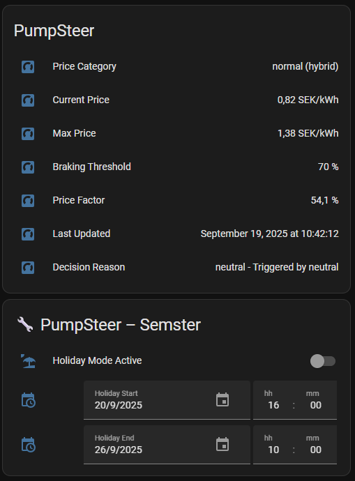
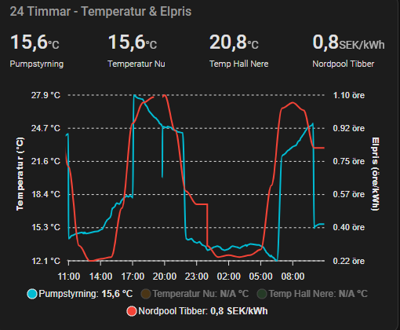
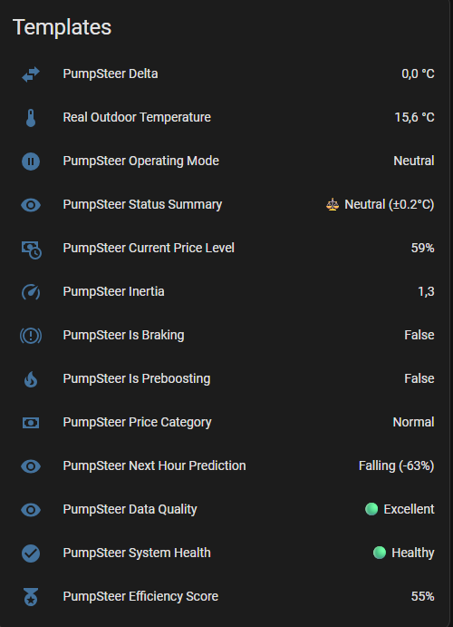
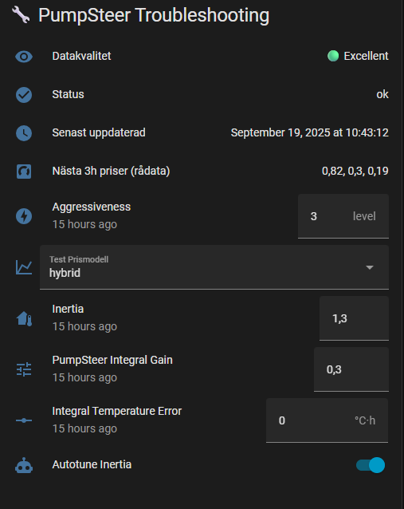

# PumpSteer

PumpSteer is a custom Home Assistant integration that dynamically optimizes your heat pump by manipulating the outdoor temperature sensor input. It helps save energy and money by adjusting your heating strategy based on electricity prices, indoor temperature, weather forecasts, and thermal inertia.

**This control system regulates heat supply solely based on outdoor temperature and lacks direct integration with your existing heating system. Therefore, it requires that the basic settings in your heating system already function correctly to achieve a consistent and comfortable indoor climate.**

<a href="https://www.buymeacoffee.com/alvjo" target="_blank">
  
</a>


<a href="https://my.home-assistant.io/redirect/config_flow_start/?domain=https%3A%2F%2Fgithub.com%2FJohanAlvedal%2FPumpSteer%2Ftree%2Fmain" target="_blank" rel="noreferrer noopener"></a>

---

## ⚠️ Disclaimer 

I'm not an expert in programming, energy systems, or automation. This setup is based on personal experiments and use. I cannot guarantee it will work for everyone, and I take no responsibility for any issues or damage resulting from the use of this configuration or code.

**Use at your own risk and thoroughly test it in your environment.**

---

## 🗃️ Recorder Data Requirement

PumpSteer calculates price levels using 72 hours of raw electricity price history from Home Assistant's recorder. Long-term statistics are not used, so ensure the recorder keeps at least three days of state data for your price sensor. Without sufficient history the price category may remain "normal" and the integration can appear stuck.

---

# PumpSteer

|  |  |
| -------------------------------------------- | ----------------------------------- |
|  |  |


---

## ✅ Features

* 🔧 Smart virtual control of outdoor temperature
* 🌡️ Dynamic comfort control using:

  * Indoor temperature
  * Target indoor temperature
  * Electricity price forecast
  * Temperature forecast (comma-separated list)
  * Thermal inertia
* 💸 Electricity price adjustment via Nordpool or other sensor
* 🧊 Braking mode: limits heating during high prices
* ☀️ Summer mode: disables heating control during warm weather
* 🏝️ Holiday mode: temporarily reduces temperature when away
* 🚀 Pre-boost: stores heat before cold or high-price periods
* ❄️ Precool: pauses heating ahead of forecasted warm weather
* 📈 Switchable price model (`hybrid` or `percentiles`)
* 🤖 ML analysis: learns how your house responds (session-based) (beta, work in progress)
* 🔁 Auto-adjustment of `house_inertia` (if enabled beta, work in progress)
* 🧠 Recommendations for improved comfort/savings balance (beta, work in progress)
* ⚙️ Adjustable heating and braking compensation factors
* 🎛️ Fine-tuning via `input_number`, `input_text`, `input_boolean`, `input_datetime`
* 🖼️ Extra sensors for UI visualization

> 💡 **Note:** Holiday mode is only active when the outdoor temperature is below the summer threshold.

## ❄️ Precool Mode

When the hourly temperature forecast shows that any of the next 24 hours will exceed the summer threshold, PumpSteer enters *precool* mode. It sends the braking temperature to the heat pump so heating stops before the warm period arrives. This prevents unnecessary heating just before summer-like conditions.

---

## 🔧 Installation via HACS (Custom Repository)

If PumpSteer is not yet available in HACS:

1. Go to **HACS > ⋮ > Custom Repositories**
2. Add: `https://github.com/JohanAlvedal/PumpSteer`
3. Choose **Integration** as category
4. Install PumpSteer
5. Restart Home Assistant
6. Follow the setup guide and select helper entities

**For a complete step-by-step installation guide, including setting up helper entities and automations, please refer to our wiki:**

[**PumpSteer - Installation och Grundkonfiguration**](https://github.com/JohanAlvedal/PumpSteer/wiki/PumpSteer-%E2%80%90-Installation-och-Grundkonfiguration)

---

## 🌤️ Weather Forecast Automation

PumpSteer requires hourly temperature forecasts in `input_text.hourly_forecast_temperatures`. Instead of manual entry, use our automated blueprint:

[](https://my.home-assistant.io/redirect/blueprint_import/?blueprint_url=https%3A%2F%2Fgist.githubusercontent.com%2FJohanAlvedal%2F48fb8b3e1ef5fc3a70b5c473be54e2fe%2Fraw%2Fpumpsteer_temperature_forcast.yaml)

### What it does:
- 🔄 Automatically fetches 24-hour temperature forecasts
- 📊 Formats data as comma-separated values for PumpSteer
- ⏰ Updates on configurable intervals (default: every 30 min)
- 🌡️ Works with SMHI, Met.no, OpenWeatherMap, and more

### Quick Setup:
1. **Import blueprint** from the Gist above
2. **Create automation** using your weather entity  
3. **Set target** to `input_text.hourly_forecast_temperatures`
4. **Configure update interval** (recommended: every 30 minutes)

Once configured, PumpSteer will automatically receive fresh weather data for optimal heating decisions without any manual intervention.

---

## 📦 Helper Entities (via `pumpsteer_package.yaml`)

| Type             | Entity                          | Function                                |
| ---------------- | ------------------------------- | --------------------------------------- |
| `input_number`   | `indoor_target_temperature`     | Target indoor temperature               |
| `input_number`   | `pumpsteer_summer_threshold`    | Threshold to activate summer mode       |
| `input_number`   | `pumpsteer_aggressiveness`      | Comfort vs savings (0–5)                |
| `input_number`   | `house_inertia`                 | How slow/fast the house responds (0–10) |
| `input_text`     | `hourly_forecast_temperatures`  | Temperature forecast (24 CSV values)    |
| `input_boolean`  | `holiday_mode`                  | Activates holiday mode                  |
| `input_boolean`  | `autotune_inertia`              | Allow system to adjust `house_inertia`  |
| `input_boolean`  | `pumpsteer_preboost_enabled`    | Enable pre-boost before cold/expensive periods |
| `input_select`   | `pumpsteer_price_model`         | Price classification model (`hybrid` or `percentiles`) |
| `input_datetime` | `holiday_start` / `holiday_end` | Automatically enable holiday mode       |

---

## 🧪 Forecast Format

`input_text.hourly_forecast_temperatures` must contain exactly 24 comma-separated temperature values (°C):

```
-3.5,-4.2,-5.0,-4.8,… (total 24 values)
```

If the format is invalid, an error will be logged and the forecast ignored.

---

## 📊 Sensor: `sensor.pumpsteer`

This sensor is the main output of the integration.

### State:

Virtual (fake) outdoor temperature sent to your heat pump.

### Attributes:

| Attribute                    | Meaning                                             |
| ---------------------------- | --------------------------------------------------- |
| `Mode`                       | `heating`, `neutral`, `braking_mode`, `summer_mode` |
| `Fake Outdoor Temperature`   | Calculated temperature sent to the heat pump        |
| `Price Category`             | Classification of current electricity price         |
| `Status`                     | System status, e.g. "OK" or error messages          |
| `Current Price`              | Current electricity price in SEK/kWh                |
| `Max Price`                  | Highest price of the day                            |
| `Aggressiveness`             | Comfort vs savings (0–5)                            |
| `Inertia`                    | Estimated house inertia                             |
| `Target Temperature`         | Desired indoor temperature                          |
| `Indoor Temperature`         | Current indoor temperature                          |
| `Outdoor Temperature`        | Real outdoor temperature                            |
| `Summer Threshold`           | Threshold for summer mode                           |
| `Braking Threshold (%)`      | Percent threshold to trigger braking                |
| `Price Factor (%)`           | Position of current price within daily range (0% = min, 100% = max) |
| `Holiday Mode`               | Whether holiday mode is active                      |
| `Last Updated`               | Last update timestamp                               |
| `Temp Error (°C)`            | Deviation from target indoor temperature            |
| `To Summer Threshold (°C)`   | Distance to triggering summer mode                  |
| `Next 3 Hours Prices`        | Upcoming electricity prices                         |
| `Saving Potential (SEK/kWh)` | Potential savings from current price                |
| `Decision Reason`            | Reason for current decision                         |
| `Price Categories All Hours` | Classification for all hours                        |
| `Current Hour`               | Current hour of the day                             |
| `Preboost Enabled`           | Whether pre-boost mode is allowed                   |
| `Data Quality`               | Availability and completeness of input data         |

---

## 🧠 Sensor: `sensor.pumpsteer_ml_analysis`

ML sensor showing analysis and recommendations based on your house's behavior.

### Attributes:

| Attribute                  | Description                                         |
| -------------------------- | --------------------------------------------------- |
| `success_rate`             | How often the system reached the target temperature |
| `avg_heating_duration`     | Average heating session duration (min)              |
| `most_used_aggressiveness` | Most used aggressiveness level                      |
| `total_heating_sessions`   | Total number of sessions                            |
| `recommendations`          | Text suggestions based on system performance        |
| `auto_tune_active`         | If automatic inertia adjustment is active           |
| `last_updated`             | Last analysis update timestamp                      |

Recommendations can be shown in UI or in markdown cards.

---

## 🧠 How it works

PumpSteer controls your heat pump's perceived demand using a fake outdoor temperature:

* Slightly increases heating (1 °C overshoot) only when electricity prices are very cheap
* Avoids heating when prices are high
* Goes to neutral mode when stable
* Disables heating when it's warm outside (summer mode)
* Pre-cools ahead of warm periods when the forecast exceeds the summer threshold
* Lowers target temp to 16 °C during holidays
* Learns over time how your house reacts and adjusts settings (if `autotune_inertia` is enabled)

All control is done locally without any cloud dependency.

---

## ❓ FAQ

### Can PumpSteer directly control my heat pump?

PumpSteer does **not** talk to the heat pump over Modbus, REST, or any proprietary interface. Instead, it exposes the calculated value as a Home Assistant sensor (`sensor.pumpsteer`) that represents a *virtual* outdoor temperature. You then feed that value into the heat pump by replacing or overriding the real outdoor temperature sensor in your automation. The heat pump still makes the final decisions using its own built-in control curve, but it reacts as if the outdoor conditions have changed. PumpSteer therefore never changes compressor set-points or flow targets directly; it only influences the built-in regulator through the fake outdoor temperature.

### What is thermal inertia and how is it calculated?

`house_inertia` describes how quickly your building responds to heating or braking. A low value (≈0.5–1.5) means the house reacts fast, so PumpSteer can shift temperatures aggressively. A high value (≈3–5) slows things down for heavy, slow houses. The value is stored in the helper `input_number.house_inertia` and you can set it manually during setup.

If you enable `input_boolean.autotune_inertia`, the machine-learning module keeps track of every heating session: it records how far the indoor temperature was from the target, how long it took to recover, and whether the session was successful. When the average duration is long, PumpSteer suggests (or automatically applies) a higher inertia. When the house recovers quickly, it suggests a lower inertia. In other words, inertia adjustments are derived from the observed heating durations—not from flow temperatures.

### What does the ML module actually learn?

The ML collector watches the indoor temperature, target temperature, aggressiveness, and inertia during every heating cycle. It estimates success rate, typical heating duration, and how often comfort targets are hit. Those statistics are used to recommend tweaks to `aggressiveness` and `house_inertia`, or to auto-tune inertia if you allow it. The learning does **not** read or require supply/return flow temperatures; it is based entirely on the inputs already provided to PumpSteer.

### Which sensors must be connected to PumpSteer?

The integration needs:

* Indoor temperature sensor (`input_number.indoor_target_temperature` + actual indoor temperature entity)
* Outdoor temperature sensor
* Electricity price sensor
* Optional: hourly outdoor temperature forecast, holiday switches, pre-boost toggle, etc.

You do **not** need to provide flow temperature, set-point, compressor status, or other proprietary heat pump sensors. As long as the heat pump follows the virtual outdoor temperature, PumpSteer can operate.

### How is the PumpSteer efficiency score calculated?

`sensor.pumpsteer_efficiency_score` is an informative metric that blends comfort and savings on a 0–100 scale. It takes the absolute indoor temperature error (penalising large deviations) and the current savings potential that PumpSteer estimates from electricity prices. The score is the average of those two sub-scores: one for comfort (`100 - temp_error × 20`) and one for cost (`min(100, saving_potential × 25)`). A value near 100 means you are close to the target temperature while also operating during favourable prices. It is **not** a direct measurement of kWh saved compared to running without PumpSteer.

---

## 🛠️ Logging

* Errors and warnings are logged in Home Assistant
* Sensor shows `unavailable` when data is missing
* ML data is stored in `pumpsteer_ml_data.json` (max 100 sessions)
* Auto-tuned `inertia` is saved in `adaptive_state.json`

---

## 🧪 Note

This is a hobby project built with the help of ChatGPT, Copilot, and a lot of patience. Feedback and improvement ideas are always welcome.

---

## 🔗 Links

* 🔗 [GitHub repo](https://github.com/JohanAlvedal/PumpSteer)
* 🐞 [Create Issue](https://github.com/JohanAlvedal/PumpSteer/issues)

---
## License
As of version v1.6.0, this project is licensed under the GNU Affero General Public License v3.0 (AGPL-3.0).
Previous versions (≤ v1.5.1) are available under the Apache License 2.0.

© Johan Älvedal
