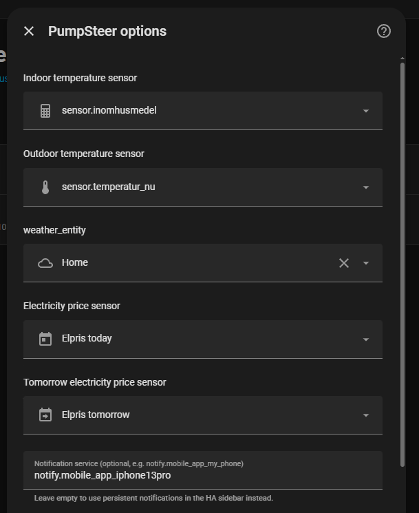

# 🔥 PumpSteer 2.0 – Smart styrning av värmepump

➡️ Engelsk version: [README](README.md)

> ⚠️ Detta är en större omskrivning. Läs uppgraderingsinformationen innan installation.

PumpSteer är en Home Assistant-integration som optimerar din värmepump genom att dynamiskt justera den **virtuella utomhustemperaturen**.

Den minskar energikostnaden när elen är dyr — samtidigt som inomhuskomforten bibehålls.

---

## 📸 Dashboard – exempel

---

## 📘 Dokumentation

- [Viktigt – inte en vanlig uppgradering](#viktigt--inte-en-vanlig-uppgradering-)
- [Nyheter i 2.0.0](#nyheter-i-200)
- [Breaking Changes](#breaking-changes)
- [Elsensorer](#elsensorer)
- [Väderstöd](#väderstöd)
- [Ny installation](#ny-installation)
- [Dashboard (Lovelace)](#dashboard-lovelace)
- [Uppgradering från 1.6.6](#uppgradering-från-166)
- [Felsökning](#felsökning)
- [Trimning](#trimning)
- [Säkerhet](#säkerhet)

---

## Configuration
- 🇸🇪 [Här](docs/Configuration_sv.md)

___

## Viktigt – inte en vanlig uppgradering ⚠️

PumpSteer 2.0.0 är **inte en liten uppdatering**.  
Det är en **helt ny kontrollmodell**.

👉 Se det som en **ny integration**, inte en uppgradering.

### Vad det innebär

- ❌ Gamla dashboards kommer inte fungera likadant  
- ❌ Automations kan sluta fungera  
- ❌ Helpers används inte på samma sätt  
- ❌ Prislogiken är helt omgjord  

---

## ⚠️ Ansvarsfriskrivning

Du använder denna integration på egen risk. Uppvärmning är en kritisk funktion i hemmet, och felaktiga inställningar kan leda till obehag eller skador.

Använd inte PumpSteer om ditt värmesystem inte fungerar som det ska.

Använd endast PumpSteer om du förstår hur det fungerar och har verifierat att det fungerar korrekt i din installation. Följ alltid upp inomhustemperatur och systemets beteende efter installation.

---

### Krävs efter uppgradering

- Bygg om Lovelace-kort  
- Uppdatera automations  
- Verifiera elsensorer (idag + imorgon)  
- Koppla om till nya entiteter  
- Justera inställningar  

---

### Beteendet är annorlunda

- PI-reglering istället för heuristik  
- Mjuk bromsning (rampning)  
- Prognosbaserade beslut  

➡️ Förvänta dig inte samma beteende som i 1.6.6  

---

### Rekommendation

1. Installera 2.0.0  
2. Observera i 24–48 timmar  
3. Migrera därefter fullt ut  

---
## 🔧 Hur PumpSteer styr din värmepump

PumpSteer styr **inte** din värmepump via Modbus, molntjänster eller börvärden.

Istället fungerar den genom att påverka **utetemperaturgivaren**.

Denna metod används ofta för att påverka värmepumpens beteende utan att ändra intern firmware eller styrsystem.

I min setup görs detta med en extern enhet som  
👉 Ohmigo Ohm On WiFi Plus  
🔗 [Ohmigo Ohm On WiFi Plus](https://www.ohmigo.io/product-page/ohm-on-wifi-plus)

Enheten kopplas in på värmepumpens utetemperaturgivare och gör det möjligt för Home Assistant att justera det **motstånd** som värmepumpen ser.

Genom att ändra motståndet simuleras en annan utetemperatur för värmepumpen.

---

### 🧠 Så fungerar det

PumpSteer beräknar en **virtuell utetemperatur** baserat på:

- Inomhustemperatur  
- Måltemperatur  
- Elpris  
- Väderprognos  
- Vald aggressivitetsnivå  

Detta värde skickas sedan till den externa enheten (t.ex. Ohm On WiFi Plus), som manipulerar givarsignalen.

👉 Värmepumpen tror att utetemperaturen har förändrats  
👉 Och justerar värmen därefter  

---

### ⚡ Vad detta möjliggör

- Minska uppvärmning när elen är dyr  
- Förvärma när elen är billig  
- Behålla komfort som högsta prioritet  
- Optimera utan att ändra värmepumpens interna styrning  

---

### 🏠 Exempel på systemarkitektur

1. Home Assistant kör PumpSteer  
2. PumpSteer beräknar virtuell utetemperatur  
3. Ohm On WiFi Plus justerar motståndet  
4. Värmepumpen reagerar automatiskt  

---

### ⚠️ Viktigt

- Denna metod kräver hårdvara som kan påverka givarsignalen  
- Installation beror på din värmepumpsmodell  
- Kontrollera alltid inkoppling och säkerhet noggrant

---

## Nyheter i 2.0.0

PumpSteer 2.0.0 introducerar ett helt nytt styrsystem med fokus på stabilitet, förutsägbarhet och kostnadsoptimering.

- 🧠 PI-baserad reglering  
- ⚡ Förenklad prislogik (`cheap / normal / expensive`)  
- 🔁 State machine (förutsägbart beteende)  
- 🧊 Dynamisk bromsning (ramp + hold + filtrering)  
- 🌦 Prognosbaserad styrning (valfri)  
- 🏠 Integration skapar egna entiteter  
- 🔒 Helt lokal (ingen cloud)  

---

## Breaking Changes

### Nya priskategorier

Tidigare:
- `very_cheap`
- `very_expensive`
- `extreme`

Nu:
- `cheap`
- `normal`
- `expensive`

---

### Krav på elsensor

Måste stödja:
- `today/raw_today`  
- `tomorrow/raw_tomorrow`  

---

### Ny styrmodell

- Tidigare: heuristik  
- Nu: PI + state machine  

---

### Ny bromslogik

- Rampning  
- Hold-logik  
- Filtrering av toppar  
- Komfortskydd  

---

### Integration hanterar entiteter

- numbers  
- switch  
- datetime  

---

### ML borttaget

---

## Elsensorer

Stödda format:

- `0.95`  
- `"0.95"`  
- `{ "value": 0.95 }`  
- `{ "price": 0.95 }`  

📌 Rekommenderat exempel:  
[`other/nordpool.yaml`](other/nordpool.yaml)

✔ Fungerar med:
- Officiella Nord Pool-integrationen  + mitt exempel (se ovan) OBS !

---

### ℹ️ Om `pump_packages.yaml`

Filen:  
[`other/pump_packages.yaml`](other/pump_packages.yaml)

är **inte längre ett komplett paket** som i tidigare versioner.

Den innehåller främst:

- Templatesensorer  
- Exempel  
- Hjälplogik  

⚠️ Viktigt:

- Inte en komplett lösning  
- Konfigurerar inte hela systemet  
- Ersätter inte integrationen  

👉 Använd som referens eller tillägg  

---

### Migrering från 1.6.6

- PumpSteer använder inte längre paket  
- Integration hanterar:
  - logik  
  - entiteter  
  - inställningar  

Du kan fortfarande använda `pump_packages.yaml` för extra funktioner.

---

## Väderstöd

Exempel:
- `weather.smhi_home`  
- `weather.yr_home`  
- `weather.openweather`  

⚠️ Väljs i:  
Inställningar → Enheter → PumpSteer → Konfigurera  

---

## Ny installation

1. Installera via HACS eller manuellt  
2. Starta om Home Assistant  
3. Lägg till integration  
4. Välj sensorer  

---

### Kontrollera att det fungerar

- `sensor.pumpsteer` aktiv  
- `status = ok`  
- `price_category` ändras  
- `mode` beter sig logiskt  

---

## Dashboard (Lovelace)

📁 Se [`/dashboards/`](dashboards/)  

Visar:
- Temperatur  
- Måltemperatur  
- Virtuell utetemperatur  
- Pris och respons  

---

### Krav

Installera:

- mini-graph-card  
- apexcharts-card  

---

### Hur man använder

1. Gå till dashboard  
2. Edit  
3. YAML-läge  
4. Klistra in  
5. Spara  

⚠️ Kan skriva över befintlig vy  

---

### Tips

- Ingen data → kolla entity  
- Kort laddar inte → installera card  
- Debug → Developer Tools  

---

## Uppgradering från 1.6.6

### Måste göras

- Uppdatera prislogik  
- Lägg till morgondagens priser  
- Uppdatera automations  
- Ta bort ML  

---

### Rekommenderat

- Kontrollera attribut  
- Lägg till väder  
- Uppdatera holiday  

---

### Testa

- Mode  
- Brake factor  
- Dyra perioder  

---

## Felsökning

### Safe mode

Orsak:
- Saknade prisdata  

Lösning:
- Kontrollera today/raw_today  
- Kontrollera tomorrow/raw_tomorrow  

---

### Ingen bromsning

Orsak:
- Inte dyrt  
- Komfortskydd aktivt  

---

## Trimning

### Aggressivitet

- 0 → ingen styrning  
- 1–2 → mild  
- 3–4 → balanserad  
- 5 → aggressiv  

---

### Tröghet

- Låg → snabb  
- Hög → långsam  

---

## Säkerhet

Använd på egen risk.

Följ alltid:
- temperatur  
- systemets beteende  

---

## Recorder

Kräver:
- minst 72h historik  

---

## Notering

Detta är ett hobbyprojekt byggt med:
- ChatGPT  
- Copilot  
- tålamod 🙂  

Feedback uppskattas — ser du något som är knas, hjälp gärna till att förbättra eller fixa det istället för att bara påpeka 🙂

---

## 🔗 Länkar

- 🔗 [GitHub repo](https://github.com/JohanAlvedal/PumpSteer)  
- 🐞 [Skapa issue](https://github.com/JohanAlvedal/PumpSteer/issues)  

---

## Licens

- ≥ v1.6.2 → AGPL-3.0  
- ≤ v1.5.1 → Apache 2.0  

© Johan Älvedal
